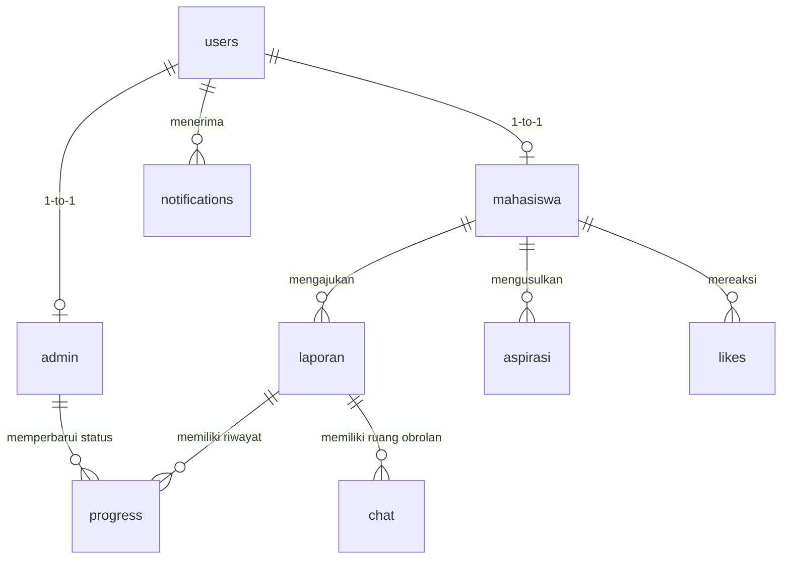

# Rancangan Database - Suara Kampus ITG

Dokumen ini mendefinisikan struktur database relasional yang siap diintegrasikan dengan backend (Laravel Sanctum/Node.js Express) untuk mendukung REST API dan WebSocket (Socket.IO).

---

## 1. Relasi Antar Tabel (Entity Relationship)

---

## 2. Struktur Tabel

### 1. `users`
Menyimpan kredensial autentikasi utama untuk mahasiswa dan administrator.

| Nama Kolom | Tipe Data | Atribut | Deskripsi |
| :--- | :--- | :--- | :--- |
| `id` | BIGINT | PK, Auto Increment | ID unik user |
| `username` | VARCHAR(50) | Unique | NIM mahasiswa atau username admin |
| `password` | VARCHAR(255) | - | Hash password (bcrypt) |
| `role` | ENUM('mahasiswa', 'admin') | - | Peran pengguna |
| `first_login` | BOOLEAN | Default: true | Menandai kewajiban ganti password admin |
| `created_at` | TIMESTAMP | - | Waktu pendaftaran |
| `updated_at` | TIMESTAMP | - | Waktu update terakhir |

---

### 2. `mahasiswa`
Data profil detail mahasiswa Institut Teknologi Garut.

| Nama Kolom | Tipe Data | Atribut | Deskripsi |
| :--- | :--- | :--- | :--- |
| `id` | BIGINT | PK, Auto Increment | ID unik mahasiswa |
| `user_id` | BIGINT | FK to `users.id`, Cascade | Hubungan ke akun user |
| `nama` | VARCHAR(100) | - | Nama lengkap mahasiswa |
| `nim` | VARCHAR(10) | Unique | Nomor Induk Mahasiswa |
| `email` | VARCHAR(100) | Unique | Format: `nim@itg.ac.id` |
| `prodi` | ENUM('Sistem Informasi', 'Teknik Informatika', 'Teknik Sipil', 'Arsitektur', 'Teknik Industri') | - | Pilihan program studi resmi ITG |
| `foto` | VARCHAR(255) | Nullable | Path file foto profil mahasiswa |
| `created_at` | TIMESTAMP | - | Waktu pembuatan profil |
| `updated_at` | TIMESTAMP | - | Waktu update profil |

---

### 3. `admin`
Data profil detail administrator pengelola platform.

| Nama Kolom | Tipe Data | Atribut | Deskripsi |
| :--- | :--- | :--- | :--- |
| `id` | BIGINT | PK, Auto Increment | ID unik administrator |
| `user_id` | BIGINT | FK to `users.id`, Cascade | Hubungan ke akun user |
| `nama` | VARCHAR(100) | - | Nama lengkap administrator |
| `created_at` | TIMESTAMP | - | - |
| `updated_at` | TIMESTAMP | - | - |

---

### 4. `laporan`
Data pengaduan yang diajukan oleh mahasiswa.

| Nama Kolom | Tipe Data | Atribut | Deskripsi |
| :--- | :--- | :--- | :--- |
| `id` | BIGINT | PK, Auto Increment | ID unik laporan |
| `tiket` | VARCHAR(20) | Unique | Format: `LPR-YYYY-XXXX` |
| `mahasiswa_id` | BIGINT | FK to `mahasiswa.id`, Set Null | Pembuat laporan |
| `kategori` | ENUM('Infrastruktur', 'Fasilitas', 'Akademik', 'Keamanan', 'Kebersihan', 'Lainnya') | - | Kategori laporan |
| `judul` | VARCHAR(150) | - | Judul singkat pengaduan |
| `deskripsi` | TEXT | - | Deskripsi detail kronologi masalah |
| `lokasi` | VARCHAR(150) | - | Lokasi kejadian di lingkungan ITG |
| `bukti_foto` | VARCHAR(255) | - | Path file foto bukti pengaduan |
| `is_anonim` | BOOLEAN | Default: false | Tampilkan pembuat atau samarkan |
| `status` | ENUM('menunggu', 'diterima', 'diproses', 'pengerjaan', 'verifikasi', 'selesai') | Default: 'menunggu' | Status 6 tingkat pengaduan |
| `created_at` | TIMESTAMP | - | Tanggal pengajuan |
| `updated_at` | TIMESTAMP | - | Tanggal update status |

---

### 5. `progress`
Catatan sejarah/riwayat perubahan status laporan pengaduan.

| Nama Kolom | Tipe Data | Atribut | Deskripsi |
| :--- | :--- | :--- | :--- |
| `id` | BIGINT | PK, Auto Increment | ID riwayat |
| `laporan_id` | BIGINT | FK to `laporan.id`, Cascade | Terhubung ke laporan mana |
| `status` | ENUM('diterima', 'diproses', 'pengerjaan', 'verifikasi', 'selesai') | - | Status baru yang dipasang |
| `komentar` | TEXT | Nullable | Keterangan/alasan dari admin |
| `admin_id` | BIGINT | FK to `admin.id`, Set Null | Admin yang memproses |
| `created_at` | TIMESTAMP | - | Waktu status dipasang |

---

### 6. `aspirasi`
Data usulan aspirasi kemajuan kampus.

| Nama Kolom | Tipe Data | Atribut | Deskripsi |
| :--- | :--- | :--- | :--- |
| `id` | BIGINT | PK, Auto Increment | ID unik aspirasi |
| `tiket` | VARCHAR(20) | Unique | Format: `ASP-YYYY-XXXX` |
| `mahasiswa_id` | BIGINT | FK to `mahasiswa.id`, Set Null | Pembuat aspirasi |
| `kategori` | ENUM('Infrastruktur', 'Fasilitas', 'Akademik', 'Keamanan', 'Kebersihan', 'Lainnya') | - | Kategori usulan |
| `judul` | VARCHAR(150) | - | Judul usulan |
| `deskripsi` | TEXT | - | Rincian usulan aspirasi |
| `gambar` | VARCHAR(255) | - | Path file gambar visual pendukung |
| `tags` | VARCHAR(255) | Nullable | Label tag dipisahkan koma (ex: `wifi,perpus`) |
| `is_anonim` | BOOLEAN | Default: false | Pengusul disamarkan atau tidak |
| `status` | ENUM('baru', 'ditinjau', 'dipertimbangkan', 'diimplementasikan') | Default: 'baru' | Status tindak lanjut aspirasi |
| `created_at` | TIMESTAMP | - | - |
| `updated_at` | TIMESTAMP | - | - |

---

### 7. `likes`
Menyimpan relasi dukungan (Like/Dislike) mahasiswa terhadap aspirasi tertentu.

| Nama Kolom | Tipe Data | Atribut | Deskripsi |
| :--- | :--- | :--- | :--- |
| `id` | BIGINT | PK, Auto Increment | ID reaksi |
| `aspirasi_id` | BIGINT | FK to `aspirasi.id`, Cascade | Aspirasi yang didukung |
| `mahasiswa_id` | BIGINT | FK to `mahasiswa.id`, Cascade | Mahasiswa yang bereaksi |
| `type` | ENUM('like', 'dislike') | - | Jenis dukungan |
| `created_at` | TIMESTAMP | - | - |

*Kunci Komposit Unik:* (`aspirasi_id`, `mahasiswa_id`) memastikan mahasiswa hanya bisa melakukan satu kali reaksi (Like atau Dislike) per aspirasi.

---

### 8. `chat`
Ruang percakapan real-time per laporan antara mahasiswa pengadu dengan admin.

| Nama Kolom | Tipe Data | Atribut | Deskripsi |
| :--- | :--- | :--- | :--- |
| `id` | BIGINT | PK, Auto Increment | ID pesan |
| `laporan_id` | BIGINT | FK to `laporan.id`, Cascade | Terhubung ke nomor laporan/room chat |
| `sender_id` | BIGINT | FK to `users.id`, Set Null | User pengirim pesan |
| `sender_role` | ENUM('mahasiswa', 'admin') | - | Mempermudah styling pengirim |
| `message` | TEXT | - | Isi pesan obrolan |
| `is_read` | BOOLEAN | Default: false | Status dibaca (✓✓ warna biru) |
| `created_at` | TIMESTAMP | - | Waktu pesan dikirim |

---

### 9. `notifications`
Pusat notifikasi global yang didistribusikan ke user secara real-time.

| Nama Kolom | Tipe Data | Atribut | Deskripsi |
| :--- | :--- | :--- | :--- |
| `id` | BIGINT | PK, Auto Increment | ID notifikasi |
| `user_id` | BIGINT | FK to `users.id`, Cascade | Penerima notifikasi |
| `type` | VARCHAR(50) | - | Jenis event (laporan, chat, aspirasi) |
| `title` | VARCHAR(100) | - | Judul notifikasi |
| `message` | VARCHAR(255) | - | Ringkasan isi pesan |
| `is_read` | BOOLEAN | Default: false | Status dibaca |
| `reference_id` | BIGINT | Nullable | ID Laporan / Aspirasi referensi klik |
| `created_at` | TIMESTAMP | - | - |

---

### 10. `pdf_documents`
Arsip berkas Laporan Penyelesaian PDF resmi yang digenerate oleh sistem.

| Nama Kolom | Tipe Data | Atribut | Deskripsi |
| :--- | :--- | :--- | :--- |
| `id` | BIGINT | PK, Auto Increment | ID berkas |
| `laporan_id` | BIGINT | FK to `laporan.id`, Cascade | Terhubung ke laporan mana |
| `admin_id` | BIGINT | FK to `admin.id`, Set Null | Admin penandatangan |
| `filepath` | VARCHAR(255) | Unique | Path lokasi penyimpanan file PDF di server |
| `created_at` | TIMESTAMP | - | Tanggal dokumen diterbitkan |
